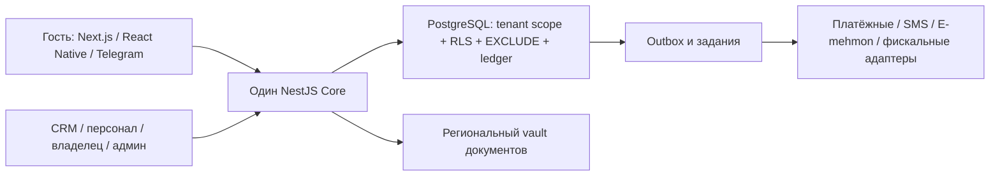

# Этап Б0 — решения, риски и план до запуска собственного фонда

Дата: **8 октября 2026**, часовой пояс **Asia/Tashkent**.
Плановый горизонт: **8 октября 2026 — 8 апреля 2027**, 13 двухнедельных спринтов.
Цель даты — ориентир планирования, не обещание запуска без команды и внешних условий.

## Подтверждено владельцем

| Вопрос | Ответ |
| --- | --- |
| Собственный фонд | 500 апартаментов: Ташкент, Самарканд, Бухара, Хива |
| Команда сейчас | Владелец работает через Codex |
| Будущая команда | Планируются разработчик, тестировщик, управляющий и бухгалтер; даты выхода не названы |
| Юрлицо и поставщики | Пока нет; сейчас нужна готовность к будущей интеграции |
| Хост/домен/постоянный ключ Android | Ранее указано, что пока отсутствуют |

Заданы три вопроса, ответы учтены. Распределение 500 апартаментов по городам,
структура объектов/корпусов и дата, отличная от шестимесячного горизонта, не заданы.
Для архитектуры считаем 500 **юнитов**, а не автоматически 500 зданий. Нужно уметь
представить и отдельный апартамент-объект, и несколько юнитов внутри объекта.
Город не заменяет organization/property scope доступа.

## Граница этого этапа

Принят новый порядок **Б0 → Б1 → … → Б11, по одному**. Исторические названия
Stage7.25–7.52 — номера старой цепочки, а не доказательство выполнения этапа Б7.
Реализованные модули переиспользуем после проверки, проект не начинаем заново.

Б0 выдаёт ADR, план, риски и критерии приёмки. Здесь не нужны новые миграции или
приложение-заглушка. Полное ТЗ: [PRODUCT_REQUIREMENTS](../PRODUCT_REQUIREMENTS.md).
Срез готового кода: [CURRENT_DELIVERY_STATUS](../CURRENT_DELIVERY_STATUS.md).

До нового порядка начата локальная незавершённая работа над тарифами: новые
owner-rates input/store/service, общий owner-operating-property, подключение
контроллера/модуля/gateway/guard и блокировка чтения тарифа в QuoteService.
Проверка типов Core прошла, но функциональные тесты и UI не выполнены. Эти изменения
остаются в рабочей копии, не включены в документальный коммит Б0 и не считаются
готовым этапом. При Б2/Б8 их нужно проверить и завершить совместимо; не удалять и
не переносить в main как проверенную функциональность.

## Архитектурные решения

| ADR | Решение | Что ещё не внедрено |
| --- | --- | --- |
| [0003: стек](../adr/0003-client-platforms-and-core.md) | NestJS/TS + PostgreSQL; Next.js гостю/хосту, React CRM/admin; React Native гостю/персоналу; общие контракты и дизайн | Next.js/RN, полноценные очереди/realtime/production infrastructure |
| [0004: организации](../adr/0004-tenant-and-actor-boundaries.md) | Общая схема, platform/host, actor + permissions + property scope + RLS, отдельный публичный каталог | Отрицательные тесты новых реестров и полноценный marketplace access |
| [0005: деньги](../adr/0005-payment-and-financial-boundaries.md) | Provider ports, hosted checkout, immutable ledger, outbox/inbox, reconciliation; фолио отдельно | Реальные адаптеры/сертификация, депозиты, фискализация и законные выплаты |
| [0006: данные](../adr/0006-regional-data-and-documents.md) | Документы и копии по умолчанию в Узбекистане, отдельный vault/KMS, regional policies | Выбор сервера/KMS, договоры, сроки хранения, реальный upload и E-mehmon |

Существующие ADR 0001/0002 остаются в силе. Новые решения не устанавливают сервисы,
не заказывают платные ресурсы и не подтверждают юридические факты из исходного ТЗ.

## Что требуется именно для 500 апартаментов

Нынешние локальные формы показывают максимум 100 объектов/номеров; черновой объект
ограничен 20 категориями/100 номерами, календарь — 1000 интервалами. Это ограничения
UI/API, а не доказанная готовность всего фонда. До запуска нужны:

- Cursor pagination, поиск/фильтры по городу/объекту/статусу и доступу; неполная
  выдача не трактуется как отсутствие объекта или свободный номер.
- Массовый импорт через staging: исходный ID, город, объект, тип, код юнита,
  тариф/политика, статус; dry-run, отчёт конфликтов, подтверждённая активация.
- Маппинг городов и доступов управляющих, поиск дублей, сверка 500 исходных и
  импортированных записей; тест данных без настоящих паспортов.
- Шахматка с ограниченным диапазоном/виртуализацией; фильтрация и серверный поиск,
  а не загрузка всей истории 500 квартир в браузер.
- Пилотная группа перед массовой активацией. Предлагаемые волны 20–50 → 150 → 500
  — операционная стратегия, не сокращение цели. Состав волн/городов утвердит владелец.

## План 13 спринтов: собственный фонд к 8 апреля 2027

Это последовательность работ над **MVP-срезом** этапов, а не обещание полного V2/V3
за 26 недель. Документированный остаток этапа не помечается выполненным. Внешнее
оформление договоров может идти параллельно силами владельца, без запуска следующего
программного этапа. Сроки пересматриваются после появления команды и оценки Б1.

| Спринт / даты | Этап Б и проверяемый результат | Условие завершения / зависимость |
| --- | --- | --- |
| 1 · 08–21.10.2026 | Б0: ADR, состав MVP, риски, аудит имеющегося кода; шаблон исходного фонда | Ответы владельца учтены; неизвестные решения явно отмечены; роли приёмки определены |
| 2 · 22.10–04.11.2026 | Б1: совместимые реестры фолио/начислений, сборов, регистрации, loyalty/promo, услуг, payout/disputes/reviews; индексы/RLS, synthetic seed | Миграции на пустой и существующей схеме; no cross-tenant access; схема для импорта 500 юнитов; миграции не переписывают ledger |
| 3 · 05–18.11.2026 | Б2: auth delivery port/SMS contract, каталог/поиск с пагинацией, цены/ограничения, hold/expiry/cancel | Реальные Core-гонки и snapshots; synthetic SMS явно помечена; команда тестирования подключена либо план пересчитан |
| 4 · 19.11–02.12.2026 | Б3: provider contracts/adapters по доступной документации, inbox/reconciliation, refund/deposit capabilities, ledger/folio связь | Идемпотентность и ошибки доказаны локально/sandbox. Без выбранного провайдера нельзя закрыть внешнюю приёмку; real payouts выключены |
| 5 · 03–16.12.2026 | Б4: CRM API — scoped шахматка, смена номера/группы, фолио/смена/ночной аудит, задачи/роли | Гонки переноса и запрет овербукинга; бухгалтер/управляющий принимают правила операций; доступны все 500 юнитов через пагинацию |
| 6 · 17–30.12.2026 | Б5: online check-in/vault contract, registration queue/deadlines/receipts, туристический сбор и отчёт | Версии правил и снимки; security-тесты файлов; реальные ставки/API/регион хранения подтверждены либо остаётся явный внешний блокер |
| 7 · 31.12.2026–13.01.2027 | Б6, часть 1: Next.js каталог/карточка/карта/поиск на Core | Реальные цены за период и состояния загрузки/ошибок; резерв сниженной доступности команды на праздничный период |
| 8 · 14–27.01.2027 | Б6, часть 2: бронь/провайдерный переход/поездка/профиль, RU/UZ/EN, mobile guest foundation | Сквозная цепочка на утверждённом sandbox; оффлайн-повторы без двойной операции; сборка на физических устройствах |
| 9 · 28.01–10.02.2027 | Б7: CRM и персонал — сегодня/карточки, задания, чек-листы/фото/инспекция | Управляющий принимает смену, горничная проходит сценарий на телефоне; audit/RLS и плохая сеть |
| 10 · 11–24.02.2027 | Б8, MVP-срез: кабинет владельца/админка собственного фонда, полный календарь тарифов, импорт/качество данных | 500 записей сверены, цены/доступность проверены. Сторонние хосты, real payouts и marketplace moderation — остаток V2 |
| 11 · 25.02–10.03.2027 | Б9, MVP-срез: связанный inbox, Telegram bot/mini app, разрешённые SMS/email/push и шаблоны | Проверка доставки/отказа/retry; verified Telegram initData; provider consent. WhatsApp и AI — по доступным договорам, полный остаток фиксируется |
| 12 · 11–24.03.2027 | Б10, MVP-срез: стабильный API, подписанные webhooks, подготовка/import rehearsal, закрытый end-to-end пилот | Отзыв ключей, retry/replay, сверка миграции; iCal при необходимости собственного фонда. Канальные API/умные замки/динамические цены — V3 |
| 13 · 25.03–07.04.2027 | Б11: нагрузка, угрозы, восстановление, мониторинг, обучение, release rehearsal | Закрыты обязательные дефекты/внешние условия. На 08.04 — решение go/no-go и только затем разрешённая активация волн |

**Ресурсное условие:** сейчас подтверждён только владелец с Codex. План предполагает
выделенного разработчика до спринта 3, тестировщика с Б2, управляющего и бухгалтера
для Б3–Б5; параллельные веб/native задачи могут потребовать второго разработчика
или более позднего native-релиза. Это потребность, не согласованный найм/расход.
Без такой команды и своевременных договоров шесть месяцев не подтверждены оценкой.

## MVP-срез и полный остаток этапов

Б1 сохраняет схему всех требуемых реестров, включая V2; это не реализация реальных
выплат. Б2–Б7 выполняют цепочку собственного фонда. Б8–Б10 имеют существенный остаток
после запуска: marketplace verification/commission/payout/moderation/disputes,
двусторонние отзывы, отдельные service orders, весь omnichannel/AI, loyalty,
канальные API, замки, новые страны. Эти пункты остаются в полном ТЗ; календарь
выше не объявляет их завершёнными и не разрешает фальшивые production-заглушки.

## Реестр рисков

| Риск / уровень | Что делаем | Ответственный и контрольная точка |
| --- | --- | --- |
| Объём 500 и неизвестная команда · высокий | Оценка Б1, приоритет MVP, пагинация/импорт, измерять скорость спринтов | Владелец; пересмотр плана после спринтов 2 и 3 |
| Нет юрлица/merchant contracts · критический для реального запуска | Provider ports сейчас; регистрацию/договоры организует владелец; внешние условия не подменять mock | Владелец + бухгалтер; статус к спринту 3, sandbox до спринта 8 |
| Не подтверждены E-mehmon/налоги/ПДн · критический | Проверка официальных требований/схемы юристом, версионированные country rules | Владелец привлекает юриста, управляющий/бухгалтер; до Б5 с реальными данными |
| Нет хоста/домена/vault/KMS · высокий | Региональная архитектура и конфиги; выбор поставщика отдельно, без покупки сейчас | Владелец + разработчик; согласованный план до спринта 6, стенд до спринта 8 |
| Существующий UI обрезает фонд · высокий | Не повышать только LIMIT; внедрить paging/filter/import и tenant-тесты | Разработчик/QA; Б2/Б4, обязательная приёмка на 500 |
| Овербукинг/двойное списание · критический | EXCLUDE, immutable snapshots, inbox/outbox, idempotency, reconciliation, реальные гонки | Разработчик/QA; Б2/Б3 и регрессия Б11 |
| Утечка tenant/паспортов · критический | RLS, explicit actor, quarantine, encryption, redaction, scoped preview | Разработчик/QA; Б1/Б5/Б11 |
| Неправильные начисления/ночной аудит · высокий | Immutable posted ledger, reversals, accounting fixtures и ручная сверка | Бухгалтер + разработчик; Б3/Б4 |
| Потеря данных при импорте/restore · высокий | Dry-run, mapping, контрольные суммы/итоги, snapshot, rehearsal и rollback | Разработчик + управляющий; Б8/Б10/Б11 |
| Native/Next миграция затянется · высокий | Совместимый API, постепенный переход, отдельные доказательства устройств | Разработчик/QA; контроль в спринте 8, не называть WebView RN |
| Провайдер недоступен / неизвестный результат · высокий | Явные статусы и очередь сверки, не автоматический денежный resend | Разработчик/оператор; Б3/Б9, runbook Б11 |
| p95/100000/99.9% не измерены · высокий | Согласовать профиль, staging hardware, нагрузку/индексы/алерты; отдельное наблюдение SLO после запуска | Разработчик/QA; Б11 |
| Не готова мобильная подпись/обновление · высокий | Постоянный ключ через secure config, recovery/update и физический телефон | Владелец + разработчик; до Б7/Б11 |
| Рост scope V2/V3 съест срок MVP · высокий | Две колонки: launch slice и полный остаток; не выдавать прототипы за готовность | Владелец/управляющий; каждый спринт |

## Приёмка перед запуском 500 апартаментов

1. Инвентаризация всех 500 юнитов, тарифов/сборов/политик и доступов четырёх городов;
   миграция воспроизводима, нет скрытых дублей или потерянных бронирований.
2. Поиск → quote → hold → оплата → receipt → check-in/регистрация → stay/folio →
   checkout/turnover; отмена/refund и ошибки провайдера проходят согласованные тесты.
3. Утверждённые юрлицо, договоры, правила налогов/документов и обработка регистрации;
   поставщики подтверждены, необходимые HTTPS/почта/SMS/Telegram настроены.
4. Нет открытых критических дефектов безопасности/денег/овербукинга. Работают
   scoped roles, MFA для привилегированных операций, аудит и отзыв доступа.
5. Измерена нагрузка. Начальный профиль для согласования: 100000 объектов в
   synthetic read dataset; 500 действующих юнитов в операционном профиле; отдельно
   read и write mix, холодный/тёплый кеш, конкурентные booking race. p95 чтения
   ≤300 мс считается по серверному API с auth/DB, внешние provider RPC отдельно.
   RPS/concurrency и hardware фиксируются перед прогоном, не подбираются после.
6. Restore проверен с ключами и ledger/provider reconciliation. Начальные цели
   для согласования: RPO ≤15 минут, RTO ≤4 часов; это ещё не измеренные результаты.
7. RU/UZ/EN, клавиатура/контраст/screen reader, мобильные устройства, медленная сеть,
   неполные списки, потеря ответа и безопасный retry приняты QA/операторами.
8. Runbooks, ответственный дежурный, мониторинг, откат, обучение и разрешение
   владельца на публикацию. 99.9% — SLO с наблюдением, не вывод из зелёного CI.

## Как воспроизвести этап 0 и перейти к Б1

Этап документальный: четыре ADR выше + этот план, без установки зависимостей,
без миграций и без тестовой записи в постоянную БД. Проверки: ссылки, календарь
13 спринтов, соответствие существующей схеме/ограничениям и git diff --check.
Не запускать непроверенный WIP тарифов как часть приёмки Б0.

Ручная проверка владельца: подтвердить распределение/модель 500 юнитов, доступность
будущей команды, выбранные обязательные платёжные способы и окно запуска. Ответы
на эти детали уточняют план, но не препятствуют совместимому аудиту схемы Б1.
Следующий этап **Б1**: сначала матрица существующих таблиц и пробелов, затем только
необходимые новые миграции/индексы/RLS и seed в одноразовой БД. Не переименовывать
старые миграции и не повторять уже существующий ledger/tax/compliance foundation.
