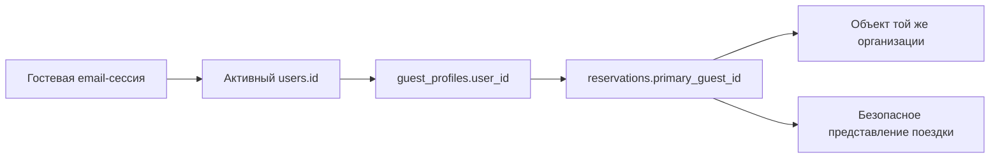

# Б2 / Б6 — поездки, привязанные к аккаунту гостя

Добавлены список поездок и карточка бронирования после гостевого email-входа.
Показываются объект/город, статус, даты в часовом поясе объекта, сумма и код
бронирования. Есть RU/UZ/EN, постраничный просмотр, обновление, пустое состояние,
ошибка сети и повтор вручную. Это чтение настоящего Core на локальном стенде;
синтетические данные создаются только в одноразовых тестах.

## Схема, доступ и компромисс

Новая миграция `0059_guest_owned_trips.sql` добавляет два индекса:
`guest_profiles_account_scope_idx` и `reservations_guest_page_idx`.
Существующие миграции и RLS-политики сотрудников не изменяются. Новых таблиц
и автоматического переноса/привязки существующих гостей нет.



Совпадение имени, email, телефона или знание кода/UUID бронирования не дают
доступа. Дополнительно совпадают организация профиля/брони и организация
объекта/брони. Некорректные старые связи между организациями закрыты для гостя.
Аккаунт может видеть свои явно привязанные профили в нескольких организациях.
Сопровождающий в `reservation_guests` не получает доступ ко всей брони.

Вместо общей гостевой RLS-политики к таблицам добавлена узкая SECURITY DEFINER
функция `app.guest_email_trips`. Она принимает хеш сессии, повторно проверяет
активность аккаунта, email, срок и отзыв сессии в одном SQL snapshot, выбирает
только разрешённые поля и использует фиксированный search_path=pg_catalog.
EXECUTE от PUBLIC отозван; существующий bootstrap выдаёт его только runtime
роли views_app. Прямой доступ гостя к таблицам не появляется. Это сохраняет
существующую архитектуру private identity и не доверяет userId из запроса/GUC.

Профиль должен быть заранее связан с правильным `users.id` доверенным процессом.
Интерфейс назначения/подтверждения этой связи в данном блоке не реализован.
Нельзя связывать чужие исторические брони по совпадению email; для этого нужен
отдельный подтверждённый процесс и аудит. Тесты создают такие связи только
в синтетических данных после проверки маркера одноразовой БД.

## API и интерфейс

Core: `GET /v1/guest-identity/email/trips?cursor=…` и
`GET /v1/guest-identity/email/trips/:id`, Bearer гостевой email-сессии.
Локальный cookie-шлюз: соответствующие GET `/guest-api/trips` и `/guest-api/trips/:id`.
Другие методы, actor-заголовки и произвольные query parameters не разрешены.
Дополнительно нужен `VIEWS_GUEST_TRIPS_PILOT_ENABLED=true`; он выключен по
умолчанию. Все прежние local/test/email gates сохранены.

Список: `{items,nextCursor}`; карточка: `{trip}`. Поля поездки:
`id, confirmationCode, status, checkInAt, checkOutAt, currency, totalMinor,
property:{name:{ru,uz,en},city,timezone}`. Сумма — строка минимальных денежных
единиц, без преобразования через Number; UZS/USD/EUR отображаются с делителем100.
Для иной валюты явно показываются минимальные единицы, пока не определён её формат.

Страница максимум20, сортировка check_in_at DESC / id DESC, выборка21 строки
для nextCursor. Курсор сохраняет микросекунды PostgreSQL: одинаковые даты не
теряют строки и не дублируются. Курсор не является разрешением; на каждой
странице повторно проверяется владение. Это последовательный просмотр, не
замороженный экспорт: изменения дат между запросами требуют обновления списка.

Неверная/отозванная сессия —401 и очистка cookie; чужая/отсутствующая поездка —
одинаковый404. Ответы no-store; шлюз повторно ограничивает состав полей.
Нет документов, контактов других гостей, замков, заметок CRM, внутренних
снимков цены/политики или данных платежей. Удаление связи профиля отзывает
чтение при следующем запросе. Уже показанные данные не стираются дистанционно
без нового запроса; realtime-отзыв/фоновое обновление сюда не входят.

## Воспроизведение

Используются существующие Node22+, зависимости двух lockfile, Docker/PostgreSQL16
и Chromium. Никаких новых сервисов или платных зависимостей.

```sh
npm run cloud:test:guest-email
npm test
npm --prefix apps/api run typecheck
node scripts/core-network-primitive-gate.mjs
node --test scripts/staff-mail.acceptance.cjs
npm run build:review
node scripts/access-portal.browser.cjs
```

Первая команда собирает web/Core, запускает полный набор API в одноразовом
PostgreSQL и настоящую цепочку SMTP → браузер → Core → БД. Теперь она включает
проверку поездок. Сид-данные: `guest-trips.integration.test.ts` и
`scripts/guest-trips-browser-proof.cjs`; внешние письма не отправляются.
Серверы и тестовый контейнер завершаются автоматически. `views_local` и её
миграционный журнал не изменялись;0059 применялась только к одноразовой БД.
Обычный `cloud:start` и публичные web/APK этим блоком не переключаются.

## Проверки и границы готовности

Локально на изменённом дереве fa48ea1: Core424/75, root264/45; оба typecheck,
web/Core builds, network152, mail15. Новые7 PostgreSQL-групп проверяют владение,
изоляцию, некорректные связи, курсоры с микросекундами, большие суммы, отзыв и gates.
Четыре новые браузерные группы проверяют22 привязанные брони, закрытые чужие,
совпадение email без связи, карточку, пагинацию, три языка при390/1280px,
ошибку сети/повтор, удаление связи и default-off. Существующие4 браузерные и
3 HTTP/SMTP группы входа также прошли. Hosted CI проверяется на коммите блока.

Отрицательный unit-тест выявил приём отсутствующего nextCursor через приведение
undefined к строке. Добавлена явная проверка типа, тесты повторно прошли.
Также добавлена очистка cookie при401 чтения поездок, чтобы гость мог войти
повторно после истечения/отзыва сессии. Логи: `/tmp/views-guest-trips-*.log`.

Проверить вручную: правильность исходной привязки профилей; исторические брони
после переноса/разделения профиля; мобильный скринридер и фокус; тексты носителями
трёх языков; длинные названия; отображение дат на переходах DST и после изменения
часового пояса объекта. Даты и сумма здесь читаются, расчёт отмены не выполняется.

Реальная почта/публичный HTTPS Core, безопасное присоединение ранее созданной
брони, изменение/отмена/оплата гостем ещё не подключены. Следующий программный
блок — подтверждённая привязка брони к аккаунту с аудитом, без автоматического
захвата по email. Это не завершение всего этапа Б6 или всех стадий Б.
